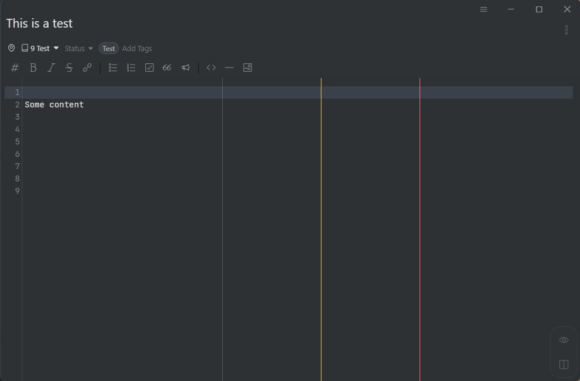

# Rulers

A plugin to expose the ruler configuration in the editor.

## Options

| Option      | Description                                                                                                                   | Default |
| ----------- | ----------------------------------------------------------------------------------------------------------------------------- | ------- |
| Columns     | A comma separated list of columns where rulers should be displayed                                                            | 80      |
| Colors      | A comma separated list of colors in hex format for rulers. If no color is specified, the color is based on the current theme. | ''      |
| Line Styles | A comma separated list of styles for rulers. Options are 'solid', 'dashed' or 'dotted'                                        | 'solid' |

Note: Whitespaces are ignored and can be used for better readability.

## Example 

<table>
    <tr>
        <th>Config</th>
        <th>Result</th>
    </tr>
    <tr>
        <td>
        <pre>
Columns: 60, 80, 100
Colors: #5a5a5a, #facc14, #f87272
Line Styles: solid</pre>
        </td>
        <td>
            
        </td>
    </tr>
</table>

## Changelog

See the [GitHub releases](https://github.com/Keisir/inkdrop-rulers/releases) for an overview of what changed in each update.

## Acknowledgements

Thanks to @mravenel for creating this plugin.
